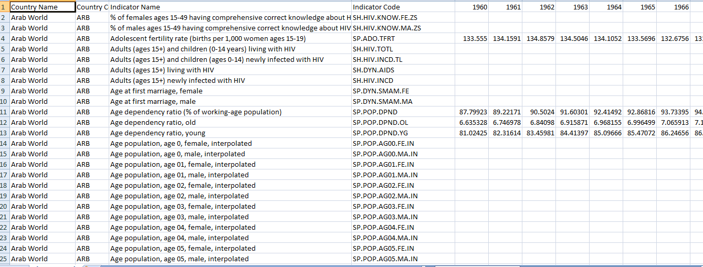

		*Statistical analysis of GridDB data, using R*

**Introduction to GridDB. **

GridDB is an in-memory database, that allows a vast quantity of data to be stored and searched quickly and safely..

A GridDb instance is made of nodes, nodes are database management processes, each node requires a physical machine for itself to run. 

A group of such nodes is called "Cluster" , the cluster service is started when all the nodes in the cluster are up and running, and all of them join the cluster. 

@Source: [https://www.toshiba-sol.co.jp/en/pro/griddb/docs-en/v432/GridDBQuickStartGuide.html](https://www.toshiba-sol.co.jp/en/pro/griddb/docs-en/v432/GridDBQuickStartGuide.html) \

Somewhat similar to the idea of a table in a relational database, GridDB gives the abstraction of a "container". 

A container has a schema, can hold data and can be indexed. 

GridDB guarantees the ACID characteristic of data for each container. 

GridDB offers two types of containers :- 

1.  'Collections' 

2. 'Time Series' containers  

Within a database, there might be multiple containers, akin to tables in a relational database. 

These containers hold the data in rows. 

**Introduction to R **

R is a modern programming language, suitable for complex mathematical calculations, statistical analysis, creating charts and machine learning models. . 

It was developed by Ross Ihaka and Robert Gentleman at the University of Auckland, New Zealand. 

The name of both of its creators start with the letter "R", hence the name given to the programming language. 

We chose R for our evaluations as R is gaining a lot of prominence in this era of big data analytics and machine learning. 

We will discuss how you can create containers and save data in GridDb via its Web API, and later query the data and analyse it through R. 

 

* Install R and HTTR package and other packages 

You can load additional packages via the "Load Packages" menu option under the "Packages" menu. 

We choose HTTR as we will connect to GridDB cloud instances via GridDB's web API. 

We will also use some other packages like "readr" and "jsonlite" etc. , for reading CSV files and processing JSON respectively. 

We use Web API as its simple and relieves the need of using an additional database connectivity package ODBC/JDBC. 

Also, GridDB SE as well as GridDB AE both versions support Web APIs, whereas GridDB SE does not support JDBC/ODBC. 

We can check if the required libraries HTTR and XML have been loaded in our R environment using the sessionInfo() command 

The output of the sessionInfo() command looks like this on my windows machine.  

You can see that the required packages were loaded under the "other attached packages:" section. 

If you want to do this from the R command line instead, use the below commands to install and include packages in your code. 

install packages('httrr')

install packages('readr')

install.packages('jsonlite')

* Connect to GridDb via HTTPS connection ( Web API). 

This method gives maximum flexibility and ease as you're not dependent on any driver or technology to connect to the database.  

You just use the simplest access methods via the secure Web API  

The GridDB URLs are of the form :-  **'https://[host]/griddb/v2/[clustername]/dbs/[databasename]' **; where a cluster might be running multiple databases managed by a single  database server instance. 

In my case, my base url looks like this:- 

baseurl = "https://cloud1.griddb.com/trialxxxx/griddb/v2/gsclustertrialxxxx/dbs/pratik"  

Lets first check if GridDb allows you a connection, we will check this via the checkConnection method of the Web API.  

r &lt;- GET(
	url = "https://cloud1.griddb.com/trialxxxx/griddb/v2/gsclustertrialxxxx/dbs/pratik/checkConnection" ,
     addheaders("Content-Type" = "application/json; charset=UTF-8" ) ,     
     config = authenticate("pratik", "MyPASS1234"), 
     encode = "json" 
  )

print( r )  

If you see a "Status: 200" in the printed response, the server is ready to accept your connections. 

While we're checking the web based access, we also confirm that secure authenticated access via HTTPS is available , as we provide the username/password. 

* The data to be used 

The data that we are going to use for this demonstration is about some economic and demographic parameters, measured in the world's major countries between 1960-2015. 

Below is a snippet about the same:-  

Countries are given scores on many criteria like Health/Education/Income/Population ratios etc., it can be found here:- 

https://data.world/data-society/global-health-nutrition-data 

To hold this data we must create a container(~table ) in GridDB. 

So, we send a POST request to the cluster with details of the container structure we need. 

#Construct a data object to hold the request body (i.e., the container that needs to be created)

mydataobj = { "containername": "GlobalHealthNutrition", 

    "containertype": "COLLECTION",
    "rowkey": False,  
    "columns": [
	{	"name": "countryname""type": " STRING" 	},    

	{ 	"name": "countrycode" 	"type": "STRING"  	},    

	{ 	"name": "indicatorname" 	"type": "STRING"   	},    
	
	{	"name": "indicatorcode"	"type": " "    	},    

	{	"name": "1960"	"type": "FLOAT"    	},    

	{	"name": "score1961"	"type": "FLOAT"    	},    

	{	"name": "score1962"	"type": "FLOAT"    	},  

	....... 

	......

	{	"name": "score2014"	"type": "FLOAT"    	},  

	{	"name": "score2015"	"type": "FLOAT"    	}
      ]  #End of container columns 
  }

#Set up the GridDB WebAPI URL

containerurl = baseurl + '/containers' 

#Lets now invoke the POST request via GridDB WebAPI with the headers and the request body 

r &lt;- POST(containerurl, 
       addheaders("Content-Type" = "application/json; charset=UTF-8" ) ,    
       config = authenticate("pratik", "MyPASS1234"), 
       encode = "json", 
      data= mydataobj)

To check if the container was indeed created, you can use the "showcontainer" command, it will list all the containers in your database. 

* Now lets define a function to insert data into the GridDB database. 

We will use R language's innate ability to process CSV files here. 

Instead of adding rows to a database table 1 by 1 OR creating a huge POST request, we just tell R to use a CSV file, and the language takes care of adding the rows on its own.  

We use readcsv function of R, which reads a CSV and returns a **tibble** ( not a full fledged data frame), a tibble is a simple data structure and can easily be fed to a POST Web API request. 

library(readr)

library(jsonlite)

#import data in csv format

ghndata &lt;- readcsv("data.csv") 

#Convert the CSV to Json format and verify it worked by printing

ghndataJSON &lt;- toJSON(ghndata) 

Now we have all the CSV data in JSON format, ready to be used in the web request. 

When POST()ing, you can include data in the body of the request. httr allows you to supply this in a number of different ways like named list, string or data frame etc. 

Also, GridDB's web API gives you a simple URL to PUT to when you want to add rows ( populate) data into containers. 

It takes the form of :- 

**baseurl + '/containers/ContainerName/rows' **

So, for us inserturl = containerurl+'GlobalHealthNutrition'+'/rows' OR  "baseurl/containers/GlobalHealthNutrition/rows" 

We now have our PUT request for inserting rows(RowRegistration) as:- 

r &lt;- PUT(inserturl,  
       addheaders("Content-Type" = "application/json; charset=UTF-8" ) ,              config = authenticate("pratik", "MyPASS1234"),  
					body = ghndataJSON ,  
					encode = "json" )  

#To check if all rows have been inserted

print(str(json.loads(x.text)['count']) + ' rows have been registered in the container GlobalHealthNutrition.') 

 
We can populate more containers like this. 

* QUERY data via SELECT - first check with a simple query 

We will try to assess some economic parameters of the countries in the World. 

So, some of the data which contains health/medical will not be used, but we keep it for future use. Also, we will be using comparatively recent data from after 2010, and leave the data from 1960-2009. Another reason for leaving the historical data is that some older statistics/numbers for many countries are missing.   

**(i) **Let's check the countries with the highest per capita income , the indicatorcode for which is **NY.GNP.PCAP.CD**.  

mysqlquery1 = "SELECT countryname, countrycode,  score2015 FROM GlobalHealthNutrition where indicatorcode=\\'NY.GNP.PCAP.CD\\'   LIMIT 10 "  

We use a single "\\" to escape the single quote in the above statement. 
To retrieve data from a container, the URL must be suffixed with "/sql" , so our 

myqueryurl = baseurl + '/sql' 

#Construct the request body,  remember we're using the web API and cannot use inbuilt R functions like dbGetQuery()/dbInsertTable(),  hence we construct the request as below. 

queryrequestbody = '[{"type":"sql-select", "stmt":"mysqlquery1"}]' 

#Invoke the GridDB WebAPI request 

qr1 &lt;- GET (url = myqueryurl, 
            addheaders("Content-Type" = "application/json; charset=UTF-8" ),       config = authenticate("pratik", "MyPASS1234"),        body = queryrequestbody
       )                              

print(qr1) 

The data that is returned is something like this:- 

ghndata &lt;- qr1  

We just copied the data in a data frame ghndata. 

To get a subset of ghndata, like all country names, we can just use ghndata$CountryName

Now let's plot this data using the barplot function of R.  

Unless you visualize something via pictures/charts, the inherent message is either not very clear or you miss the audacity of the results.  

The general syntax of this function is:- 

**barplot(H, xlab, ylab, main, names.arg, col, args.legend)** where 

**H:** This parameter is a vector or a matrix containing numeric values which are used in a bar chart.   

**xlab** and **ylab **are labels of x-axis and y-axis repectively 

**main**: chart title 

**names.arg**: Cector of names or strings, appearing under each bar 

**col**: color of the bars 

**args.legend**: optional, determines where the legend will be placed and displayed.  

# print ghndata and countrynames, just for illustrating the data , then plot the graph 

print(ghndata ) 

print(countrynames)

barplot( ghndata$Income, main="Top 10 Countries by per capita Income", names.arg = ghndata$CountryCode  , xlab="CountryName", ylab="Per Capita Income", col="blue", args.legend="bottomright" )  

 

The above image shows the data and the shortened bar graph, the actual full chart looks like this below. 

**(ii)**  Let's fire another query on GridDB, and analyze the results via R and plot the results . 

We will find the top countries based on the factor "Cause of death, by communicable diseases and maternal, prenatal and nutrition conditions (% of total) ". 

This data, e.g., is important for organizations working on public health, specially in poorer countries. 

Keeping the other calls same, we just change the query to ( only bottom 20 results) :- 

mysqlquery2 =  "SELECT countryname, countrycode,  score2014 FROM GlobalHealthNutrition where indicatorcode=\\'SH.DTH.COMM.ZS\\' ORDER BY score2014 DESC  LIMIT 20 " 

Our bar plot function will look like:- 

barplot( ghndata$$Percent, main="Cause of death, by communicable diseases and maternal, prenatal and nutrition conditions", names.arg = ghndata$CountryCode, xlab="CountryName", ylab="Percent of Total", col="blue", args.legend="bottomright" ) 

The bar plot looks like this:-  \

* To Conclude, we have demonstrated the capabilities of GridDB, a fast in-memory database that lends itself well for not only fast querying but also analytics. 

GridDB can work with multiple languages and has data connectors for  most popular tools. 

Transitioning to GridDb is easy as it follows almost similar syntax as other database products. 

GridDB's fast query and analytics engine adds power and speed to your queries. 

GridDb's error messages are easy to understand, pin-pointed and give you a clear indication of where the trouble might be.  
